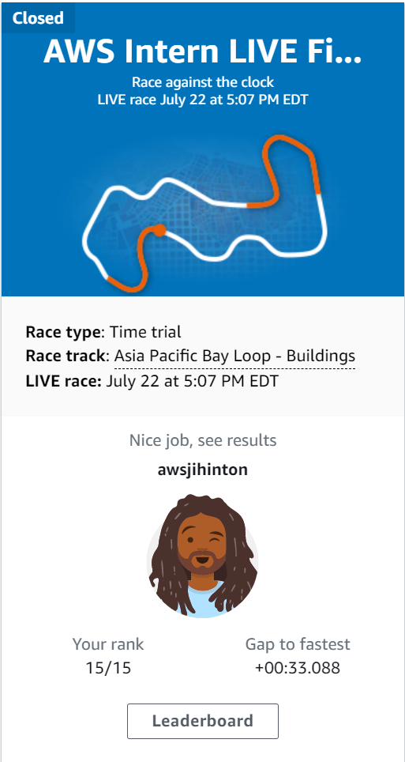
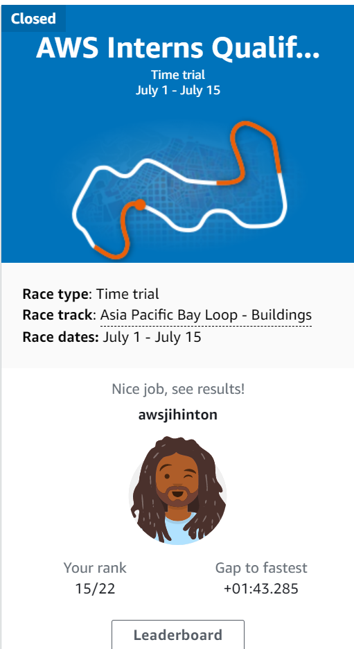
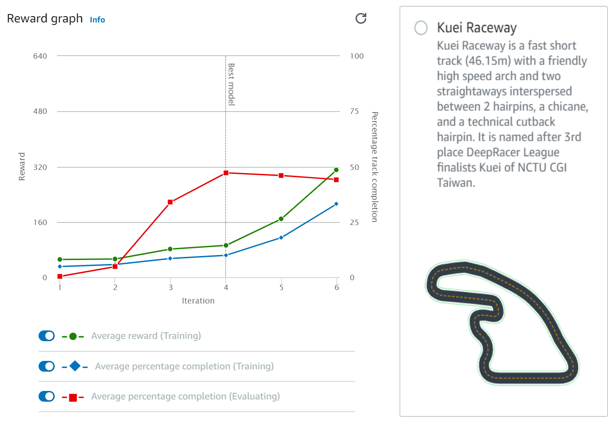
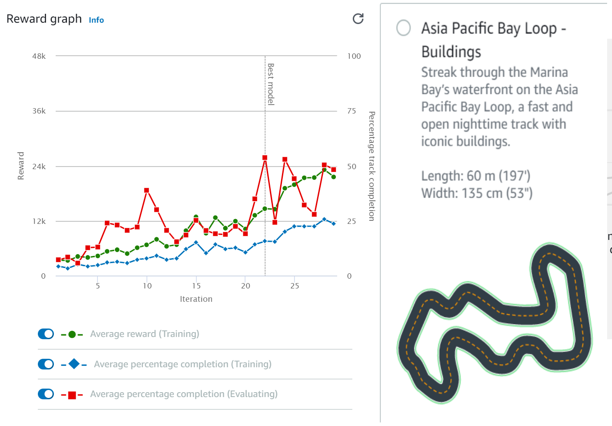
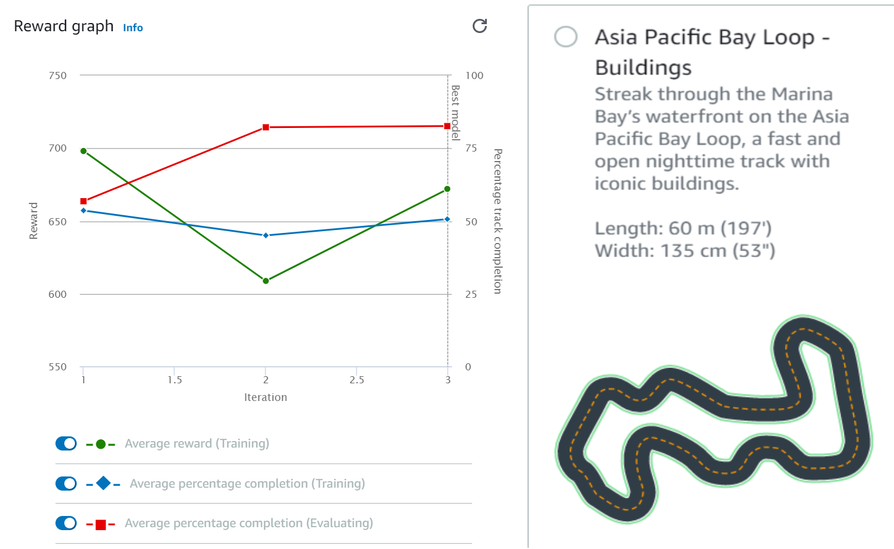

# 

<p align = center>
  
  
  
  
</p>

# Deepracer2021
## About
This README describes my strategy for competing in the AWS Intern LIVE DeepRacer competition. This was an AWS Early Career Talent competition that gave interns the opportunity to create and train a DeepRacer model. Racers competed for the opportunity to win AWS DeepRacer merch. It was important to establish an action space, create a reward function for reinforcement learning, and experiment with various hyperparameters regulating the underlying 3-layer neural network during the model's development.


<p align="center">

</p>


### About me
<p align="center">
<a href="https://www.linkedin.com/in/josh-hinton/"></a>
</p>

### Contents
- [About](#About)
- [Results](#Results)
- [Development](#Development)
  - [Initial Model](#Initial-Model)
  - [Qualifier Model](#Qualifier-Model)
  - [Finals Model](#Finals-Model)
- [Conclusion](#Conclusion)

## Results
### AWS Intern LIVE Finale 2021 (15th Place)
#### Track - Asia Pacific Bay Loop - Buildings
<p align="center">

</p>

### AWS Interns Qualifier 2021 (15th Place)
#### Track - Asia Pacific Bay Loop - Buildings
<p align="center">

</p>

## Development
I'd like to preface this section by informing you that prior to the Deepracer event, my expertise of AI/ML was limited to a handful of YouTube videos. The end outcome of my experimentation was a set of 25 trained models and a newfound respect for AI/ML.

### Initial Model
I ran a simple Python reward function provided by AWS to familiarize myself with the concept of Deepracer models. I ran my model on Kuei Raceway for two hours; the reward graph is below.

<p align="center">

</p>

The sub-rewards can be seen in this code snippet from [reward_simple.py](reward/dev/reward_simple.py):

```python
   # Give a very low reward by default
    reward = 1e-3

    # Give a high reward if no wheels go off the track and
    # the agent is somewhere in between the track borders
    if all_wheels_on_track and (0.5*track_width - distance_from_center) >= 0.05:
        reward = 1.0

```


### Qualifier Model
The organizers informed participants that all qualifiers and the Finals would be held on the Track - Asia Pacific Bay Loop - Building, which meant that I could begin training my models exclusively on that track. Another fantastic feature of AWS DeepRacer is the ability to clone old models into new ones that keep the training data from the previous model. This enables the use of multiple reward functions to provide a cumulative advantage over a single reward function model.

#### Tuning Hyperparameters 
Tuning the neural network's hyperparameters was critical to ensuring the model was trained in a reasonable amount of time. Between training sessions, I would analyze the reward graph and the Amazon Kinesis video stream of the evaluation runs to determine whether hyperparameters needed to be modified. Training sessions lasted 2-5 hours depnding on the stability of the most recent model, and the hyperparameters selected.

The average percentage completion rate during evaluation was the most relevant indicator for tuning (the red points in the reward graph). These indicated the distance traveled by the car before veering off course during evaluation runs. Early in the training phase, it was advantageous to prioritize action space exploration via faster learning. 

<p align="center">

</p>

As the model improved and my focus shifted to fine-tuning the driving technique for increased speed and reliability, I aimed to stabilize learning. This was accomplished primarily by decreasing the learning rate and increasing the gradient descent batch size, epochs, and experience episodes between each policy-updating iteration. The reward curve below is from one of my recent qualifying model training sessions and indicates more steady learning.

<p align="center">

</p>

#### Developing the reward function

Waypoints
```python
def reward_function(params):

    # Reward weights
    speed_weight = 100
    heading_weight = 100
    steering_weight = 50

    # Initialize the reward based on current speed
    max_speed_reward = 10 * 10
    min_speed_reward = 3.33 * 3.33
    abs_speed_reward = params['speed'] * params['speed']
    speed_reward = (abs_speed_reward - min_speed_reward) / (max_speed_reward - min_speed_reward) * speed_weight
    # Penalize if slow speed action space

    # - - - - -

    # Penalize if the car goes off track
    if not params['all_wheels_on_track']:
        
        return 1e-3
    
    # - - - - - 
    
    # Calculate the direction of the center line based on the closest waypoints
    next_point = params['waypoints'][params['closest_waypoints'][1]]
    prev_point = params['waypoints'][params['closest_waypoints'][0]]

    # Calculate the direction in radius, arctan2(dy, dx), the result is (-pi, pi) in radians
    track_direction = math.atan2(next_point[1] - prev_point[1], next_point[0] - prev_point[0]) 
    # Convert to degree
    track_direction = math.degrees(track_direction)

    # Calculate the difference between the track direction and the heading direction of the car
    direction_diff = abs(track_direction - params['heading'])
    if direction_diff > 180:
        direction_diff = 360 - direction_diff
    
    abs_heading_reward = 1 - (direction_diff / 180.0)
    heading_reward = abs_heading_reward * heading_weight
    
    # - - - - -
    
    # Reward if steering angle is aligned with direction difference
    abs_steering_reward = 1 - (abs(params['steering_angle'] - direction_diff) / 180.0)
    steering_reward = abs_steering_reward * steering_weight

    # - - - - -
    
    return speed_reward + heading_reward + steering_reward
```

Gauss curve
```python
# Implement speed incentive
go_fast = select_speed(waypoints, closest_waypoints, FUTURE_STEP, MID_STEP)

if go_fast and speed > SPEED_THRESHOLD:
    reward += 0.5

elif not go_fast and speed < SPEED_THRESHOLD:
    reward += 0.5  
```

### Finals Model
#### Redefining the action space

## Conclusion
